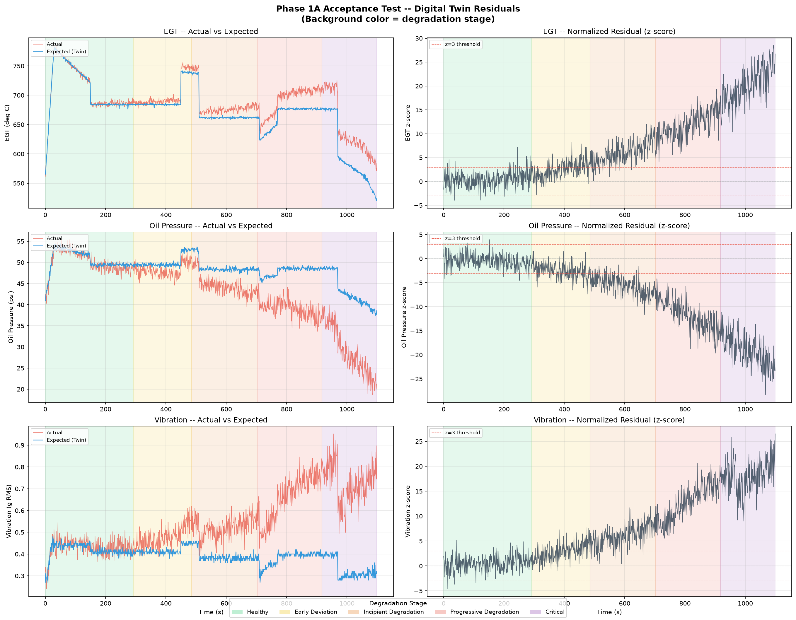

# UAV Engine Digital Twin — Phase 1A Progress Report
### Date: 3rd September 2026
### Project: SIH — UAV Engine Prognostic Health Management

---

## What We Built Today

We completed **Phase 1A** — the foundation of our entire system. In one day, we built a working pipeline that can detect engine degradation by comparing real sensor readings against what a healthy engine should show.

### The Pipeline (3 modules)

```
Sensor Data  →  Digital Twin  →  Residual Engine  →  "Is the engine healthy?"
(12 sensors)    (predicts         (compares actual
                 healthy values)   vs expected)
```

### What Each Module Does

| Module | File | Purpose |
|--------|------|---------|
| **Telemetry Generator** | `simulation/telemetry_generator.py` | Simulates realistic UAV engine flights with 12 sensors. Generates both healthy runs and degrading engine runs. |
| **Digital Twin** | `ml/digital_twin.py` | An ML model (XGBoost) trained ONLY on healthy engine data. Given operating conditions (RPM, throttle, altitude, etc.), it predicts what a healthy engine's sensors should read. |
| **Residual Engine** | `backend/residual.py` | Calculates the difference between actual readings and healthy predictions. Normalizes it as a z-score so all sensors are comparable. |

### Key Result

The system produces a **z-score** for each sensor at every timestep:
- **z-score near 0** → Engine is healthy (actual matches expected)
- **z-score > 3** → Something is wrong
- **z-score > 10** → Critical degradation

Our test results show **15-16x difference** between healthy and critical z-scores — the system clearly detects degradation.

---

## Generated Data

We created 8 synthetic flight datasets:

| File | Type | Purpose |
|------|------|---------|
| `data/healthy_run_01.jsonl` to `05.jsonl` | Healthy engine | Used to TRAIN the Digital Twin (5,500 samples) |
| `data/trajectory_run_01.jsonl` to `03.jsonl` | Degrading engine (healthy → critical) | Used to TEST the system |

Each file contains 1,100 samples (1 sample per second = ~18 min flight) with these sensors:

**Inputs (operating conditions):** RPM, Throttle, MAP, Altitude, Ambient Temp

**Outputs (what the twin predicts):** EGT, CHT, Oil Pressure, Oil Temp, Vibration, Fuel Flow

---

## Model Training Results

Trained 6 XGBoost regressors (one per output sensor) on 5,500 healthy samples.

| Sensor | Mean Absolute Error | Meaning |
|--------|-------------------|---------|
| EGT (exhaust temp) | 1.77°C | Model predicts within ~2°C of actual |
| CHT (cylinder head temp) | 1.20°C | Very accurate |
| Oil Pressure | 0.60 psi | Very accurate |
| Oil Temp | 0.87°C | Very accurate |
| Vibration | 0.017 g | Excellent |
| Fuel Flow | 0.18 L/h | Excellent |

---

## Acceptance Test — Visual Proof

The plot below shows the system working on a trajectory run (engine going from healthy to critical):



### How to read the plot:
- **Left column**: Red line = actual sensor reading, Blue line = what the twin predicts (healthy)
  - In the GREEN region (healthy), red and blue OVERLAP — engine matches expectations
  - In the RED/PURPLE region (degraded), red and blue DIVERGE — engine is failing
- **Right column**: Z-score residuals over time
  - Near 0 in healthy region
  - Spikes to 20+ in critical region
- **Background colors**: Green = healthy, Yellow = early deviation, Orange = incipient, Red = progressive, Purple = critical

### Quantitative Results:

| Sensor | Healthy |z| | Critical |z| | Ratio |
|--------|-----------|------------|-------|
| EGT | 1.30 | 20.13 | **15.5x** |
| Oil Pressure | 1.17 | 19.02 | **16.2x** |
| Vibration | 1.25 | 18.12 | **14.5x** |

---

## Tests

21 unit tests — all passing.

| Test File | Tests | What it checks |
|-----------|-------|---------------|
| `test_telemetry_generator.py` | 11 | Data schema, degradation stages, sensor ranges, replay interface |
| `test_digital_twin.py` | 5 | Predictions, condition-awareness, model save/load |
| `test_residual.py` | 5 | Residual arithmetic, z-score normalization |

---

## How to Run the Demo

### Prerequisites
- Python 3.10+ installed
- Open a terminal in the project folder (`e:\Project\SIH\UAV`)

### Step 1: Run the interactive demo
```
.venv\Scripts\python.exe demo.py
```
This walks through 5 steps with explanations. Press Enter to advance. It shows:
1. Raw sensor data from a healthy flight
2. How sensors change as the engine degrades
3. Digital Twin predicting healthy values vs actual degraded values
4. Residual z-scores comparing healthy vs critical samples
5. Opens the acceptance plot automatically

### Step 2: Run all tests (should show 21/21 green)
```
.venv\Scripts\python.exe -m pytest tests/ -v
```

### Step 3: View the acceptance plot
Open this file:
```
tests\acceptance_plot.png
```

### Other useful commands
```
# Regenerate all synthetic data:
.venv\Scripts\python.exe -m simulation.telemetry_generator

# Retrain the Digital Twin model:
.venv\Scripts\python.exe -m ml.digital_twin

# Regenerate the acceptance plot:
.venv\Scripts\python.exe tests/test_acceptance.py
```

---

## Project Folder Structure

```
UAV/
├── simulation/
│   └── telemetry_generator.py    ← generates synthetic flights
├── data/
│   ├── healthy_run_01..05.jsonl  ← training data (healthy only)
│   └── trajectory_run_01..03.jsonl ← test data (healthy → critical)
├── ml/
│   ├── digital_twin.py           ← ML model (train + predict)
│   └── artifacts/                ← saved models + std_healthy.json
├── backend/
│   └── residual.py               ← residual calculation
├── tests/
│   ├── test_telemetry_generator.py
│   ├── test_digital_twin.py
│   ├── test_residual.py
│   ├── test_acceptance.py        ← end-to-end test
│   └── acceptance_plot.png       ← the proof plot
├── docs/
│   └── this report + plot copy
├── demo.py                       ← interactive team demo
└── requirements.txt              ← Python dependencies
```

---

## What's Next — Phase 1B

Phase 1A gives us residuals (the signal). Phase 1B will use these residuals to build:

| Module | What it does |
|--------|-------------|
| **Anomaly Detector** | Flags when something is wrong (true/false) |
| **Fault Classifier** | Identifies WHAT is wrong (bearing wear, exhaust leak, etc.) |
| **Health Index** | Overall engine health as a percentage (0-100%) |
| **RUL Estimator** | Predicts remaining useful life in hours + confidence |

After Phase 1B, we build the dashboard (Phase 2) and mission risk analyzer (Phase 3).

---

*Report generated: 3 Sep 2026 | Phase 1A — Complete*
