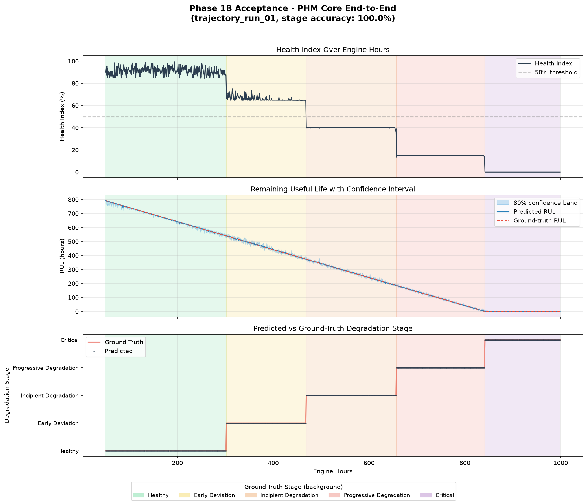

# UAV Engine Digital Twin — Phase 1B Progress Report
### Date: 4th September 2026
### Project: SIH — UAV Engine Prognostic Health Management

---

## What We Built Today

We completed **Phase 1B** — the AI PHM (Prognostic Health Management) Core. This is the "brain" that takes the residual signals from Phase 1A and turns them into actionable health assessments.

### The Full Pipeline Now

```
Sensor Data  →  Digital Twin  →  Residual Engine  →  AI PHM Core  →  Health Assessment
(12 sensors)    (predicts         (compares actual    (4 models)       - Is it anomalous?
                 healthy values)   vs expected)                        - What stage?
                                                                      - How healthy? (0-100)
                                                                      - How long until failure?
                 [Phase 1A ✓]      [Phase 1A ✓]       [Phase 1B ✓]
```

### What Each New Module Does

| Module | File | Purpose |
|--------|------|---------| 
| **Data Prep** | `ml/prepare_phm_dataset.py` | Processes all trajectory runs through the Phase 1A pipeline to create a labeled training table (3,300 rows) with residual z-scores, degradation stages, and RUL hours |
| **Anomaly Detector** | `ml/anomaly_detector.py` | Isolation Forest trained on healthy-only data. Detects when the engine is behaving abnormally. Threshold set at 99th percentile of healthy data (data-driven, not hardcoded) |
| **Fault Classifier** | `ml/fault_classifier.py` | XGBoost multi-class classifier. Given residual z-scores + engine hours, predicts which of 5 degradation stages the engine is in |
| **RUL Estimator** | `ml/rul_estimator.py` | XGBoost regressor. Predicts remaining useful life in hours, plus a confidence interval (80% band using quantile regression) |
| **Health Index** | `ml/health_index.py` | Deterministic formula combining anomaly score + degradation stage + classifier confidence into a 0–100% health score |
| **PHM Core** | `ml/phm_core.py` | Single entry point — calls all four models and returns one unified health assessment |

---

## Key Results

### Fault Classifier: 100% accuracy (held-out run)

Trained on trajectory runs 1 & 2, tested on run 3 (split by run, not by row):

| Stage | Precision | Recall | F1 |
|-------|-----------|--------|----|
| Healthy | 1.00 | 1.00 | 1.00 |
| Early Deviation | 1.00 | 1.00 | 1.00 |
| Incipient Degradation | 1.00 | 1.00 | 1.00 |
| Progressive Degradation | 1.00 | 0.99 | 0.99 |
| Critical | 0.99 | 0.99 | 0.99 |

### RUL Estimator: 2.47h MAE

- **Mean Absolute Error**: 2.47 hours (on held-out run 3)
- **80% confidence band width**: ~10.6 hours average
- Uses 3 XGBoost models: point estimate + 10th/90th percentile quantile regression

### Health Index

- Healthy engine: **90–100%**
- Critical engine: **0–5%**
- Smooth degradation through stages (not hard jumps)

### Acceptance Test (Full Pipeline Replay)

Replayed trajectory_run_01 through the entire pipeline (1,100 samples):
- **Health Index**: starts at 90.0%, ends at 0.0%  ✓
- **RUL**: starts at 791.9h, ends at 0.0h  ✓
- **Stage accuracy**: 100%  ✓

---

## The Acceptance Plot



### How to read the plot:
- **Top panel (Health Index)**: Black line shows health dropping from ~90% to 0% as the engine degrades. Background colours show ground-truth degradation stages.
- **Middle panel (RUL)**: Blue line is predicted remaining life; red dashed is ground truth. Light blue band is the 80% confidence interval. They track closely.
- **Bottom panel (Stages)**: Predicted stages (dots) perfectly match ground truth (red line) — the classifier gets every stage transition right.

---

## Tests

**45 unit tests — all passing** (21 from Phase 1A + 24 new from Phase 1B).

| Test File | Tests | What it checks |
|-----------|-------|----------------|
| `test_telemetry_generator.py` | 11 | Data schema, degradation stages, sensor ranges |
| `test_digital_twin.py` | 5 | Predictions, condition-awareness, save/load |
| `test_residual.py` | 5 | Residual arithmetic, z-score normalization |
| `test_phm_units.py` | 24 | All 4 PHM models: output keys/types, value ranges, healthy-vs-critical sanity |

Plus the acceptance test script that generates the proof plot.

---

## How to Run Everything

### Prerequisites
- Python 3.10+ installed
- Open a terminal in the project folder (`e:\Project\SIH\UAV`)

### Step 1: Run all tests (should show 45/45 green)
```
.venv\Scripts\python.exe -m pytest tests/test_phm_units.py tests/test_digital_twin.py tests/test_residual.py tests/test_telemetry_generator.py -v
```

### Step 2: Generate the PHM acceptance plot
```
.venv\Scripts\python.exe -c "import sys; sys.path.insert(0, '.'); exec(open('tests/test_phm_acceptance.py').read())"
```
Opens `tests/phm_acceptance_plot.png`.

### Step 3: Try a single prediction
```python
from ml.digital_twin import DigitalTwin
from backend.residual import ResidualEngine
from ml.phm_core import PHMCore

twin = DigitalTwin.load()
residual_engine = ResidualEngine.from_file()
phm = PHMCore.load()

# Get a sample (e.g., from a trajectory file)
sample = {"rpm": 3500, "throttle": 65, "map": 55, "altitude": 8000,
          "ambient_temp": -1, "egt": 700, "cht": 165, "oil_pressure": 45,
          "oil_temp": 90, "vibration": 0.4, "fuel_flow": 10}

expected = twin.predict(sample)
residual = residual_engine.compute(sample, expected)
result = phm.predict(residual["residual_z"], engine_hours=500.0)
print(result)
```

### Other commands
```
# Regenerate training data:
.venv\Scripts\python.exe -m ml.prepare_phm_dataset

# Retrain anomaly detector:
.venv\Scripts\python.exe -m ml.anomaly_detector

# Retrain fault classifier:
.venv\Scripts\python.exe -m ml.fault_classifier

# Retrain RUL estimator:
.venv\Scripts\python.exe -m ml.rul_estimator
```

---

## Project Folder Structure (Updated)

```
UAV/
├── simulation/
│   └── telemetry_generator.py       ← generates synthetic flights
├── data/
│   ├── healthy_run_01..05.jsonl     ← training data (healthy only)
│   ├── trajectory_run_01..03.jsonl  ← test data (healthy → critical)
│   ├── phm_training_table.csv       ← [NEW] labeled features for PHM training
│   └── healthy_residuals.csv        ← [NEW] healthy residual_z for anomaly detector
├── ml/
│   ├── digital_twin.py              ← ML model (train + predict)
│   ├── prepare_phm_dataset.py       ← [NEW] data prep script
│   ├── anomaly_detector.py          ← [NEW] Isolation Forest
│   ├── fault_classifier.py          ← [NEW] XGBoost 5-class classifier
│   ├── rul_estimator.py             ← [NEW] XGBoost RUL + confidence interval
│   ├── health_index.py              ← [NEW] deterministic health formula
│   ├── phm_core.py                  ← [NEW] unified entry point
│   └── artifacts/                   ← saved models + configs
│       ├── twin_*.joblib            ← Phase 1A: Digital Twin models
│       ├── std_healthy.json         ← Phase 1A: healthy std deviations
│       ├── anomaly_detector.joblib  ← [NEW] Isolation Forest model
│       ├── anomaly_meta.json        ← [NEW] threshold + normalisation
│       ├── fault_classifier.joblib  ← [NEW] XGBoost classifier
│       ├── fault_classifier_classes.json ← [NEW] class label mapping
│       ├── rul_point.joblib         ← [NEW] RUL point estimate
│       ├── rul_lower.joblib         ← [NEW] RUL 10th percentile
│       └── rul_upper.joblib         ← [NEW] RUL 90th percentile
├── backend/
│   └── residual.py                  ← residual calculation
├── tests/
│   ├── test_telemetry_generator.py
│   ├── test_digital_twin.py
│   ├── test_residual.py
│   ├── test_phm_units.py            ← [NEW] Phase 1B unit tests (24 tests)
│   ├── test_phm_acceptance.py       ← [NEW] end-to-end acceptance + plot
│   ├── acceptance_plot.png          ← Phase 1A proof plot
│   └── phm_acceptance_plot.png      ← [NEW] Phase 1B proof plot
├── docs/
│   ├── phase1a_progress_report.md
│   └── phase1b_progress_report.md   ← this report
├── demo.py                          ← interactive team demo
└── requirements.txt
```

---

## What's Next — Phase 2/3

Phases 1A + 1B give us the complete analytics engine. The next phases build on top:

| Phase | What it builds |
|-------|---------------|
| **Phase 2** | Real-time dashboard (FastAPI backend + frontend) displaying health_index, RUL, stage, anomaly alerts |
| **Phase 3** | Mission Analyzer + Mission Risk + What-If scenarios (can the engine complete this mission?) |

The key integration point: **everything downstream calls `PHMCore.predict(residual_z, engine_hours)`** — the single unified interface.

---

*Report generated: 4 Sep 2026 | Phase 1B — Complete*
